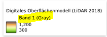

# Changes aufgrund Versionsupdate auf 3.28

        Hier unterhalb werden die "changes" dokumentiert, welche mit dem Versionsupdate zusammenhängen

## für AGI-MA        
### Attribute vom Typ Boolean: Aus `t` wird `true` und aus `f` wird `false`
Bei Attributen vom Typ Boolean gelten neu im QML-File und im simi die Werte `true` und `false` (Alt/QGIS2 `t` und `f`).   
Im QML-File betrifft das die Ausdrücke beim Filtern. Im simi betrifft das die WMS-Formatierung (in der Tabelle) und das Jinja-Template.
  
Damit das QML-File Rückwärtskompatibel ist, haben wir alle Filterausdrück auf `xx='t' OR xx='true'` oder `xx='f' OR xx='false'` geändert. 
An einem späteren Zeitpunkt werden wir diese Filterausdrücke auf `xx IS TRUE` oder `xx IS FALSE` umstellen.

### Verändertes Verhalten WGC Massstabsgrenzen in den QML-Files
Neu darf die Massstabsgrenze im QML-File nicht gleich sein wie die Massstabsgrenzen im Web GIS Client. 
Die Massstabsgrenze im QML-File sollte mindestens **+1** zur Massstabsgrenzen im Web GIS Client sein.
  
Betrifft: `minimumScale`, `maximumScale`, `scalemaxdenom` und `scalemindenom`
  
Beispiel: Ein Layer soll nur im Massstab 1:1 bis 1:20'000 im Web GIS Client sichtbar sein. 
Im QML-File muss `maximumScale='200001'` definiert werden.

### Verändertes Verhalten von NULL (fehlende Werte) bei Jinja-Templates
Bei Attributen vom Typ Varchar wird der Wert `NULL` nicht mehr leer sondern als `-` zurück gegeben. Das hat Einfluss auf Abfragen in den Jinja-Templates. 
Neu muss man ein Attribut folgendermassen auf 'NULL'-Value abfragen: 
``

### Symboldefinitionen mit Karteneinheiten => neu "Meter im Massstab"
Bei einigen Layern wird die Strichdicke von bspw. Umrandungslinien in Karteneinheiten anstatt in mm definiert. Dies führt in gradbasierten Koordinatensystemen zu Problemen. 
Dort werden die Linien sehr schnell sehr dick gerendert.
  
In QGIS Server 3 gibt es neu die Auswahlmöglichkeit ***"Meter im Massstab"***. Anstelle von *"Karteneinheiten"* muss man neu *"Meter im Massstab"* verwenden.

### Ausschnitt- und Massstabsunabhängige Legende

In den neueren WMS-Versionen gibt es den GetLegendGraphic request nur noch für "SLD-WMS". 

Für minimale WMS ohne SLD wird dem Client statisch über die Eigenschaft LegendUrl im GetCapabilities eine massstabsunabhängige Legende übermittelt.

#### Konsequenz für QGIS-Server als "SLD-WMS"

Die Reduktion der Legende auf das aktuell im Kartenbild sichtbare ist nicht möglich, da der GetLegendGraphic Request keinen Parameter "bbox" umfasst.

#### Unschöne "Extrembeispiele" bei Nutzung der statischen LegendUrl (Ohne GetLegendGraphic Request)

[AV Grundstücke](https://geo-t.so.ch/api/v1/legend/somap?SERVICE=WMS&VERSION=1.3.0&REQUEST=GetLegendGraphic&LAYER=ch.so.agi.av.grundstuecke&FORMAT=image%2Fpng&STYLE=default&SLD_VERSION=1.1.0)

[AV Bodenbedeckung und Einzelobjekte](https://geo-t.so.ch/api/v1/legend/somap?SERVICE=WMS&VERSION=1.3.0&REQUEST=GetLegendGraphic&LAYER=ch.so.agi.av.bodenbedeckung_einzelobjekte&FORMAT=image%2Fpng&STYLE=default&SLD_VERSION=1.1.0)

[(NPL Grundnutzung)](https://geo-t.so.ch/api/v1/legend/somap?SERVICE=WMS&VERSION=1.3.0&REQUEST=GetLegendGraphic&LAYER=ch.so.arp.nutzungsplanung.grundnutzung&FORMAT=image%2Fpng&STYLE=default&SLD_VERSION=1.1.0)

## für AGI-MA und GIS Koordinatoren      
### Veränderte Darstellung Objektinformation von 0-Values bei Attributen vom Typ Numeric
Bei Attributen vom Typ Numeric wird der Wert `0` neu nicht mehr `0.00` sondern `0` in der Objektinformation dargestellt. 

### Verändertes Darstellung Objektinformation von NULL-Values bei Attributen vom Typ Varchar
Bei Attributen vom Typ Varchar wird der Wert `NULL` nicht mehr leer sondern `-` in der Objektinformation dargestellt. 

### Veränderte Darstellung bei objektbasierter Transparenz
Wenn sich innerhalb eines Layers die Objekte überschneiden ist das Verhalten der transparenten Flächenfüllung nicht mehr gleich. 
Die sich überschneidenden Flächenabschnitte werden nicht mehr transparent übereinander Dargestellt. 
QGIS Server 2:  

 
QGIS Server 3:  

### Verändertes Verhalten der Legende bei Rasterbilder mit dem Interpolationstyp `Linear`
QGIS Server 2: Die Legende wird im Web GIS Client Horizontal gemäss Wertebereichsdefinition im QGIS dargestellt.  

  
QGIS Server 3: Die Legende wird Linear im Web GIS Client dargestellt. 

### Ausschnitt- und Massstabsunabhängige Legende
Mit QGIS-Server-2 wurde die Legende einer Kartenebene im Web GIS Client nur angezeigt, wenn im aktuellen Kartenausschnitt Objekte von dieser Kartenebenen vorkommen. 
Neu wird die Legende von der Kartenebene immer **vollständig** angezeigt. Unabhängig davon ob im aktuellen Kartenausschnitt Objekte vorkommen oder nicht.

### Verändertes Verhalten des Legende-Titels bei Rasterbilder
in der Legende von Rasterbildern wird neu beim Legende-Titel noch **Band 1 (Grey)** auf einer zusätzlichen Zeile aufgeführt. 

# Known Issues mit QGIS 2.16

         Hier unterhalb werden die "known issues" dokumentiert, welche NICHT mit dem Versionsupdate zusammenhängen. Sprich komische Verhalten, welche heute auch auf der Produktion bestehen. 

## für AGI-MA und GIS Koordinatoren 
### Layer mit definierter Transparenz im simi wird im WMS nicht transparent Dargestellt

Beispiel: https://geo.so.ch/map/?k=8bb75fe88         
