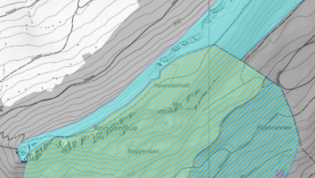
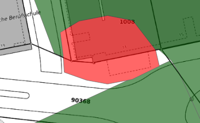
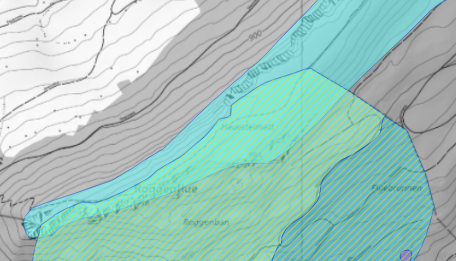
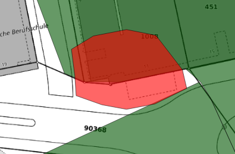
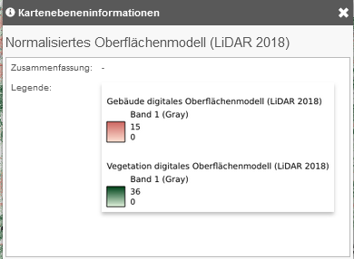
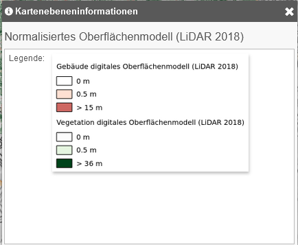
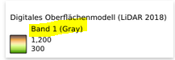
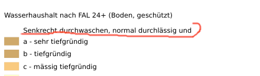
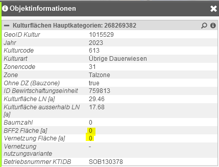
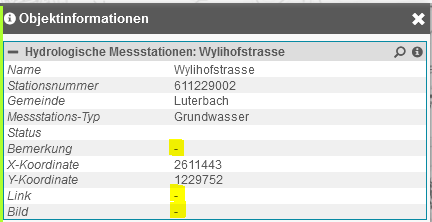

# Verhaltensänderungen mit QGIS Server Version 3.28

## Karte

### Transparenz wird auf Layer angewendet

QGIS Server 3 - Transparenz per Layer:

QGIS Server 2 - Transparenz per Feature:
 

Konsequenz: Sich überlagernde Features werden nicht mehr transparent übereinander dargestellt.

## Legende

### Legende nicht mehr vom Kartenausschnitt abhängig

Mit QGIS-Server-2 wurde die Legende einer Kartenebene im Web GIS Client nur angezeigt, wenn im aktuellen Kartenausschnitt Objekte von dieser Kartenebenen vorkommen.

Neu wird die Legende von der Kartenebene für den entsprechenden Massstab immer **vollständig** angezeigt. Unabhängig davon ob im aktuellen Kartenausschnitt Objekte vorkommen oder nicht.

### Rasterbilder mit dem Interpolationstyp `Linear`

QGIS Server 3: Die Legende wird Linear im Web GIS Client dargestellt.

QGIS Server 2: Die Legende wird im Web GIS Client Horizontal gemäss Wertebereichsdefinition im QGIS dargestellt.

### Für Raster-Layer erscheint hinter der Layer-Überschrift "Band 1 Gray"

### Darstellungsgruppen sind "text-bündig"

In V2 waren die Gruppen linksbündig.

## Objektabfrage

### Veränderte Darstellung von 0-Values bei Attributen vom Typ Numeric

Bei Attributen vom Typ Numeric wird der Wert `0` neu nicht mehr als `0.00` sondern als `0` dargestellt.

### Verändertes Darstellung von NULL-Values bei Attributen vom Typ Varchar

Bei Attributen vom Typ Varchar wird der Wert `NULL` nicht mehr leer sondern mit `-` dargestellt.

# Weiterhin bestehende "Eigenheiten"

Die folgenden Verhalten sind während dem Testen aufgefallen, stehen aber nicht im Zusammenhang mit dem Versionswechsel von QGIS Server.

## Karte

### Layer Transparenz wird im WMS nicht transparent dargestellt

Beispiel: https://geo.so.ch/map/?k=8bb75fe88     